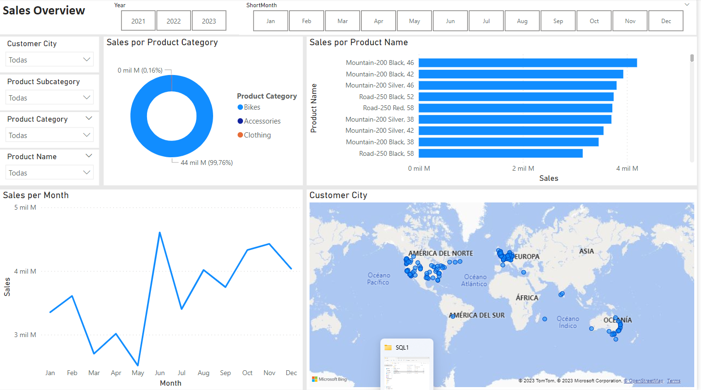

# salesReportSQLBI
In this repository I show the dashboard created upon some SQL queries.

The initial info is a Database created from microsoft that can be found [here](https://learn.microsoft.com/en-us/sql/samples/adventureworks-install-configure?view=sql-server-ver15&tabs=ssms)
